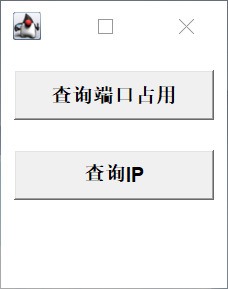
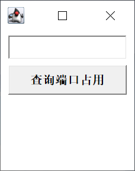
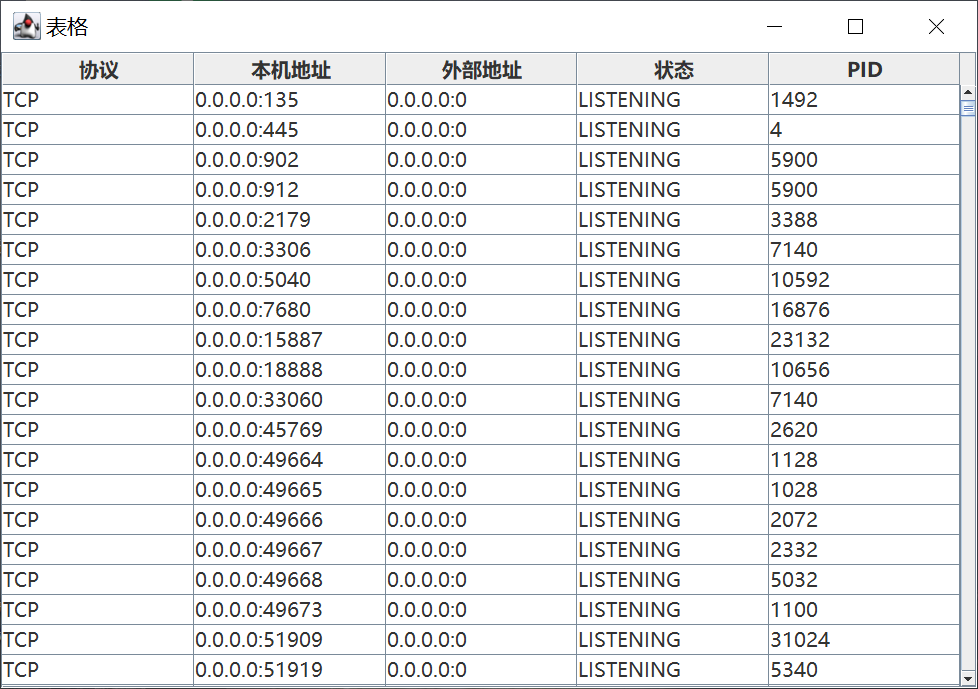
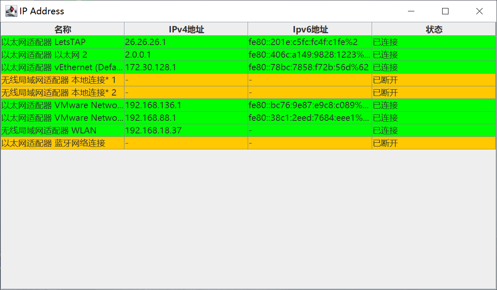

# WindowsGadgetsApp
轻量化的windows小工具

##### 还在每次为莫名其妙端口占用而烦恼吗? 还在每次都百度查询端口占用和kill的命令吗?

这款小工具提供了可视化的查询指定端口占用情况, 并可以通过右键kill掉指定进程. 虽然项目毫无技术含量, 但有用.

软件还支持一键查询ip地址(ipconfig), 虽然更没技术含量, 但可视化

##### 前排提示, 本软件毫无适配可言, 一切适配都是以我电脑为主, 所以如果界面混乱, 纯属正常现象

#### 界面截图:

1. 菜单页:

2. 查询端口占用 (无参数时查询所有)

   

   

3. 查询ip

   

#### 感谢名单:

`Java`, `launch4j`, `IntelliJ IDEA`, `ipconfig`, `netstat -ano|findstr ""`, `taskkill /f /r /pid ""`
